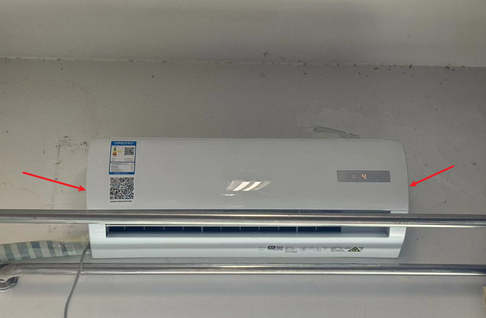
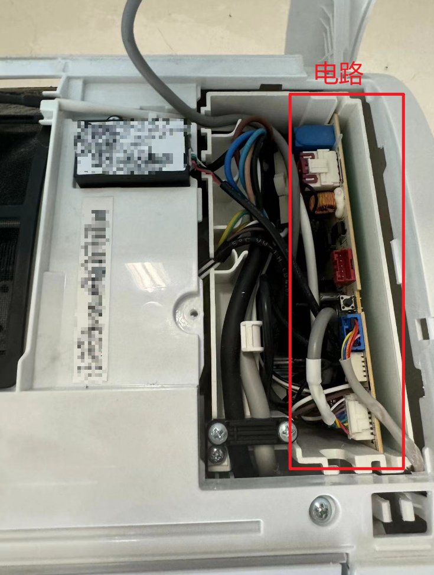
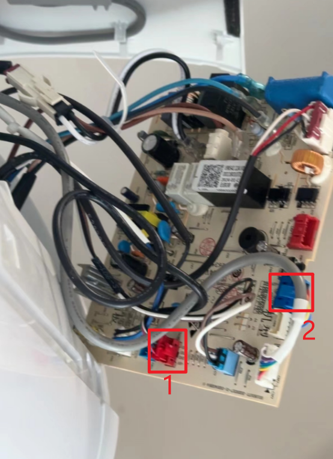

# 海享租空调破解方案
今天宿舍的空调到期了，苦于阴间的海享租软件使用体验及价格，故决定发挥一下学校老师所教并付之于实践。

### 【注意事项】

（1）请断开电源操作，防止被电死

（2）高空作业注意跌落风险

### 【操作步骤】

（1）打开空调上盖：这一步很简单，直接扣开即可（扣图一所示位置）

（2）拧下右侧盖子，您能很清楚的看到螺丝的位置

（3）小心的取出电路板，如图二所示

（4）拔下无线控制器和启动控制器，见图三中的1、2引脚

（5）安卓手机下载一个空调遥控器，选择海尔，即可打开

### 【声明】

本文仅用于科研学习，不提供任何建议，也不承担因模仿本文内容而造成的安全损伤责任。
